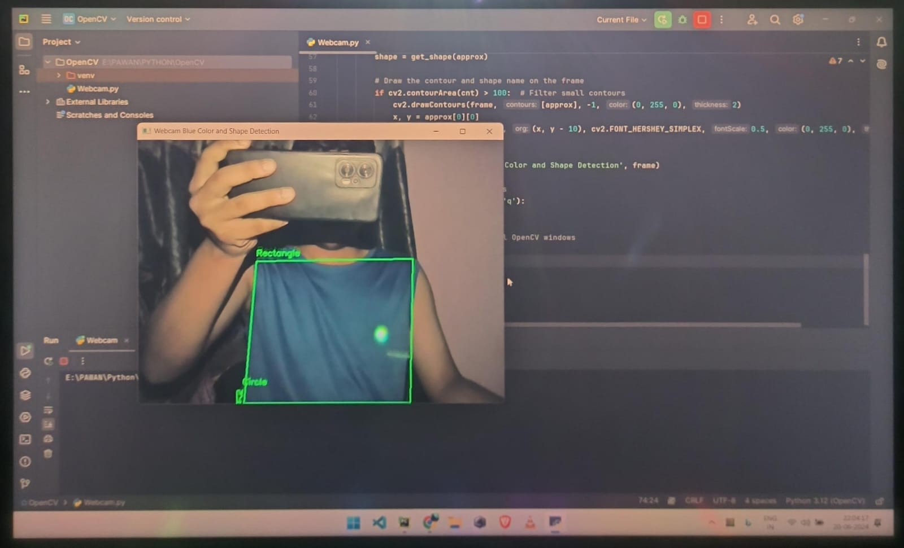
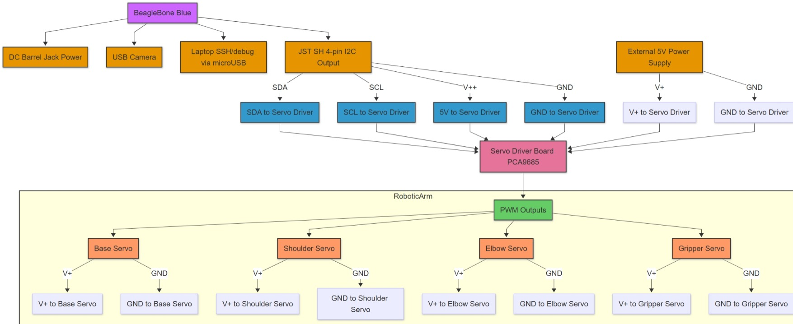

# Color based object identification and pick and place using BeagleBone Blue board

A low-cost, edge-based robotic arm system using a USB camera and BeagleBone Blue. This project identifies objects based on color using computer vision and controls a 4-axis robotic arm through I2C-enabled servo driver or direct PWM outputs for pick-and-place tasks.

---

## Project Highlights

* Real-time **color detection** using OpenCV
* Object shape analysis with contour filtering
* 4-axis **servo-driven robotic arm** control
* I2C-based servo driver (PCA9685) or direct PWM
* Fully integrated with **BeagleBone Blue**
* USB camera + live image processing
* Wireless SSH/VNC + SD card expansion
---

## Hardware Setup

| Component              | Purpose                     |
| ---------------------- | --------------------------- |
| BeagleBone Blue        | Edge controller             |
| USB Camera             | Visual input                |
| Servo Driver (PCA9685) | PWM signal generator        |
| 4x Servo Motors        | Control arm joints          |
| Breadboard + JST       | Signal distribution         |
| External 5V Power      | Powers servos independently |
| 16GB SD Card           | System expansion            |

📘 Full setup instructions: [BeagleBone Blue Setup Guide](beaglebone_setup.md)

---

## Software Overview

* `color_detection.py` — Real-time HSV filtering and mask generation
* `color_classifier.py` — Classifies colors using HSV ranges
* `main.py` — Integrates detection and triggers servo positions
---

## Results & Demonstration

### Color Detection Output

### Hardware Connection Diagram

### Live Demos

#### Color & Object Detection

.gif)

#### Full Arm Movement (I2C-based Control)

.gif)

---

## Requirements

See [`requirements.txt`](requirements.txt) for all Python + hardware-related dependencies.

---

## Additional Utilities

* `rc_test_servos` — test individual servo channels
* `fswebcam` — image testing via CLI
* VNC for GUI access on BeagleBone Blue

---

## Notes

* Used Arduino for early arm functionality testing
* LED blinking verified GPIO setup on BBB
* Wi-Fi configured for wireless SSH/VNC
* Storage expanded using a 16GB SD card

---

